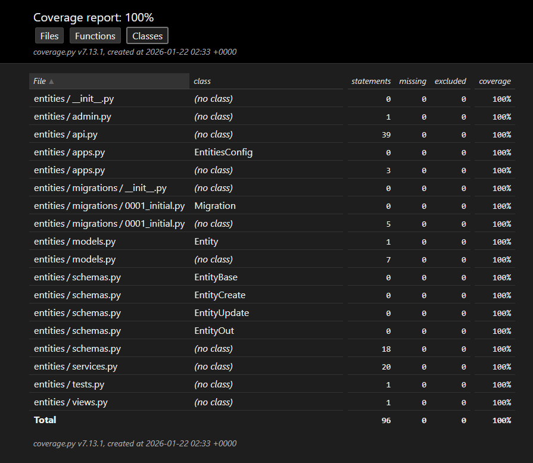

# Inventory API (Django + Django Ninja)

A simple RESTful API for managing `Entity` records, built with **Django** and **Django Ninja**.

## Main Features

- Full CRUD operations for entities
- Interactive OpenAPI/Swagger documentation at `/api/docs`
- Tests with pytest + coverage reporting
- Production-ready structure (PostgreSQL + Docker friendly)

## Entity Model

| Field         | Type         | Required | Notes                           |
|---------------|--------------|----------|---------------------------------|
| `id`          | int          | auto     | Primary key                     |
| `type`        | string(100)  | yes      | Entity type                     |
| `name`        | string(255)  | no       | Descriptive name                |
| `description` | text         | no       | Detailed description            |
| `created_at`  | datetime     | auto     | Creation timestamp              |

## API Endpoints

| Method | Endpoint                | Description                     |
|--------|-------------------------|---------------------------------|
| GET    | `/api/entities`         | List all entities               |
| GET    | `/api/entities/{id}`    | Retrieve single entity          |
| POST   | `/api/entities`         | Create a new entity             |
| PUT    | `/api/entities/{id}`    | Update an existing entity       |
| DELETE | `/api/entities/{id}`    | Delete an entity                |

## Prerequisites

- Python 3.11+
- Virtual environment recommended (`venv`)

## Local Development Setup

### 1. Create and activate virtual environment
```bash
# Linux/macOS:
python -m venv .venv
source .venv/bin/activate

# or on Windows (PowerShell): 
.\.venv\Scripts\Activate.ps1
``` 

### 2. Install dependencies
```bash
pip install -r requirements.txt
```

### 3. Apply migrations
```bash
python manage.py migrate
```

### 4. Run the server:
```bash
python manage.py runserver
```

Interactive API documentation will be available at:  
**http://localhost:8000/api/docs**


## Testing & Coverage

### 1. Run tests with HTML coverage report
```bash
pytest --cov=entities --cov-report=html:coverage_html
```

### 2. View the report
```bash
python -m http.server --directory coverage_html 8000
```
→ open **http://localhost:8000**


